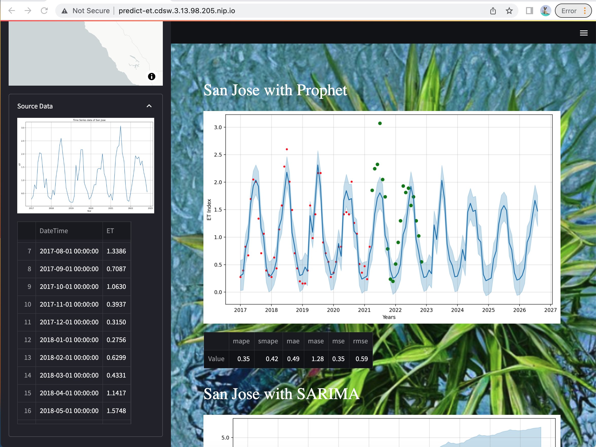

# Predicting EvapoTranspiration Index using time-series ML algorithms


A minimal example of a [Streamlit](https://www.streamlit.io/) application running as a CML or CDSW Application.
We display and chart a small dataset with Seaborn.

## Repository Structure

```bash

├── src/                         # Empty folder.
├── scripts/
│   ├── download_data.py
│   ├── install_dependencies.py  # This script installs all required Python packages.
│   ├── train_model.py           # Empty script, as we train our models on-the-fly.
│   └── launch_app.py            # This script launches the predictET App.
├── app/
│   └── app.py                   # The code for the Streamlit-based predictET App.
├── static/                      # Directory for assets for this documentation.
├── .project-metadata.yaml       # Declarative specification of this project.
├── README.md                    # This file!
└── requirements.txt             # Python 3 package requirements.

```

## Launching the project on CML

We recommend manual setup:

1. In a CML workspace, click "New Project" and add a Project Name. Select "Git" as the Initial Setup option, copy in the repo URL `https://github.com/danikagupta/predictET`, and click "Create Project". 
2. Launch a Python 3 Workbench Session with 4GiB RAM and run `!pip3 install -r requirements.txt` to install requirements. You may need to run this step twice to complete the installation after initial failure.
3. Then create a CML Application as described in the [CML documentation](https://docs.cloudera.com/machine-learning/1.1/applications/topics/ml-applications.html), using `scripts/launch_app.py` as the script.

## Launching the app

Once the CML Application has been created, you can launch it from the Applications pane.
This should open a browser window, with a Streamlit application running at a URL
similar to `http://predict-et.cdsw.3.13.98.205.nip.io/`.

If everything worked, you should see an application like this:


## Using the app

Please use dark mode for the best viewing experience.

All controls are in the sidebar on the left side:
* Three different viewing modes: Two-column, Tabbed, and Full-page.
* Choose from several different choices of backgrounds.
* Choose from ten different cities in the Bay Area.
* How many months of original data to use for training.
* How many additional months to forecast.

The sidebar also shows:
* Map with the city location.
* Input data visualized as a graph.
* Raw input data.

Predictions are based on four models:
* Prophet
* SARIMA
* Theta
* Ensemble, with median of these three models

The main screen shows the following for each model:
* A graph showing the input data along with the model predictions for visual analysis.
* Six quality metrics - in general, the lower the better.

Here are six screenshots:





